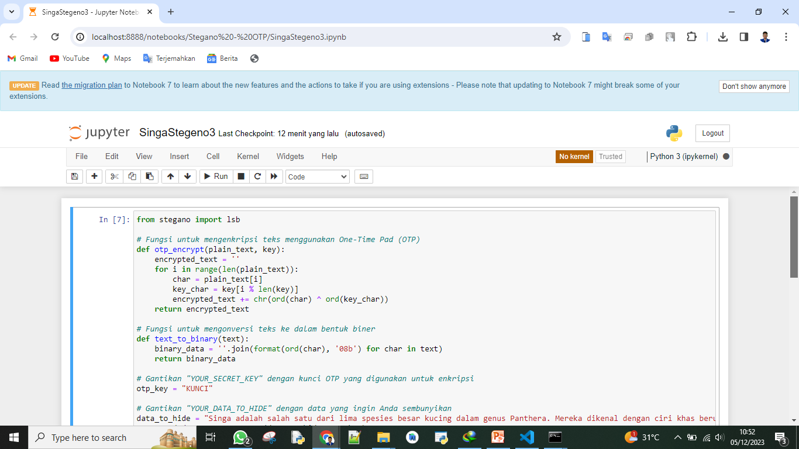
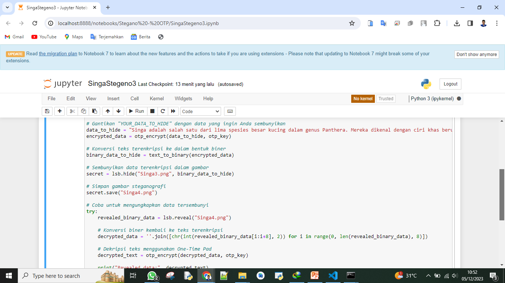
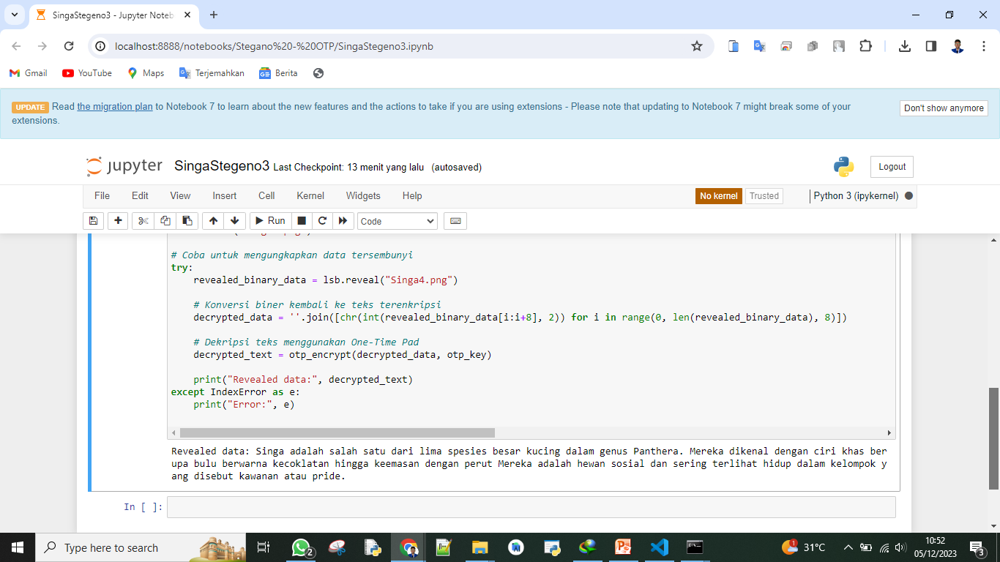

# Kriptografi Pertemuan 11


## Profil
| #               | Biodata                      |
| --------------- | ---------------------------- |
| **Nama**        | M. AKMAL AL ABDILAH          |
| **NIM**         | 312110034                    |
| **Kelas**       | TI.21.A.1                    |
| **Mata Kuliah** | Kriptografi                  |


<hr>

<p align="center">
 
</p>
<p align="center">
<a href="https://github.com/akmalabdilah"></a>
<p align="center">


<hr>


<hr>

## Implementasi Stegano

<hr>

<p>

<h2>Fungsi OTP yg digunakan</h2>

<b>Fungsi untuk mengenkripsi teks menggunakan One-Time Pad (OTP)</b>

```py
def otp_encrypt(plain_text, key):
    encrypted_text = ''
    for i in range(len(plain_text)):
        char = plain_text[i]
        key_char = key[i % len(key)]
        encrypted_text += chr(ord(char) ^ ord(key_char))
    return encrypted_text
```

<p>Fungsi untuk mengonversi teks ke dalam bentuk biner</p>

```py
def text_to_binary(text):
    binary_data = ''.join(format(ord(char), '08b') for char in text)
    return binary_data
```


<h2>Foto Kode di Jupyter Notebook</h2>





<p>
 sekian and selesai.
</p>

<div>
<h2 align="center">Thanks For Reading!!!</h2>
<div align="center">

